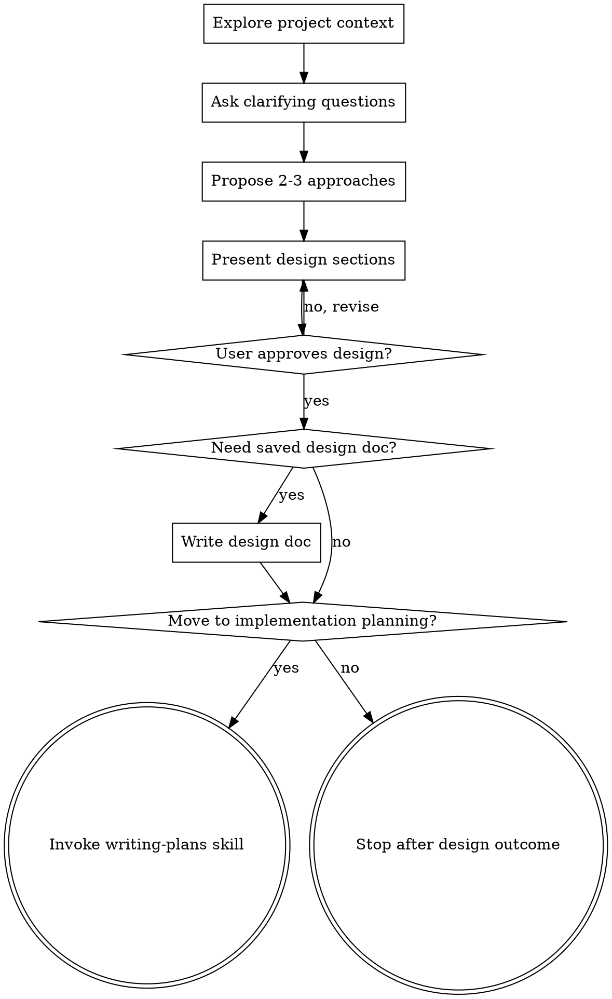

# Brainstorming Ideas Into Designs

## Overview

Help turn ideas into fully formed designs and specs through natural collaborative dialogue.

Start by understanding the current project context, then ask 2-3 most relevant questions per round (max 6 total) to refine the idea. Once you understand what you're building, present the design and get user approval.

## Trigger Conditions (Narrow Scope)

Use this skill only when at least one condition is true:

1. The user explicitly asks to discuss, brainstorm, compare options, or design with the agent.
2. Requirements are still materially unclear, there are meaningful solution trade-offs, and the user is clearly trying to enter a design phase before implementation.

### Do Not Trigger

- The user already gave a clear implementation plan or precise execution steps.
- The task is a straightforward implementation request with little ambiguity.
- The task is bug fixing, debugging, review, or explanation-only work.
- The user wants direct execution rather than design discussion.
- The request is exploratory or research-oriented but not intended to produce an implementation design.

<HARD-GATE>
When this skill is active, do NOT invoke any implementation skill, write any code, scaffold any project, or take any implementation action until you have presented a design and the user has approved it.
</HARD-GATE>

## Anti-Pattern: "This Is Too Simple To Need A Design"

Do not assume a task needs brainstorming just because it sounds new. Only use this process when ambiguity, trade-offs, or explicit discussion needs justify it. If the task is simple and already well specified, do not trigger this skill.

## Checklist

You MUST create a task for each of these items and complete them in order:

1. **Explore project context** — check files, docs, recent commits
2. **Ask clarifying questions** — ask 2-3 most relevant questions per round (max 6 total), understand purpose/constraints/success criteria
3. **Propose 2-3 approaches** — with trade-offs and your recommendation
4. **Present design** — in sections scaled to their complexity, include WHAT/WHY/HOW, get user approval after each section
5. **Write design doc if needed** — save to `docs/plans/<topic>_design_YYYYMMDD.md` only when the user wants a saved artifact or the surrounding workflow requires it
6. **Transition only if requested** — invoke `writing-plans` only when the user wants to move from approved design into implementation planning

## Process Flow

**The terminal state is usually invoking writing-plans when the user wants implementation planning.** Do NOT invoke implementation skills directly from brainstorming. If the conversation remains exploratory, stop after delivering the design outcome the user asked for.

## The Process

**Understanding the idea:**
- Check out the current project state first (files, docs, recent commits)
- Ask 2-3 most relevant questions per round to refine the idea
- Keep total clarifying questions at 6 or fewer
- Use Simplified Chinese when interacting with the user during brainstorming
- Prefer multiple choice questions when possible, but open-ended is fine too
- Focus on understanding: purpose, constraints, success criteria

**Exploring approaches:**
- Propose 2-3 different approaches with trade-offs
- Present options conversationally with your recommendation and reasoning
- Lead with your recommended option and explain why

**Presenting the design:**
- Once you believe you understand what you're building, present the design
- Scale each section to its complexity: a few sentences if straightforward, up to 200-300 words if nuanced
- Ask after each section whether it looks right so far
- Cover: WHAT, WHY, HOW, architecture, components, data flow, error handling, testing
- Be ready to go back and clarify if something doesn't make sense

## After the Design

**Documentation:**
- Write the validated design to `docs/plans/<topic>_design_YYYYMMDD.md` only when the user wants a saved design artifact or the surrounding workflow requires it
- Write any saved document primarily in Simplified Chinese
- Use elements-of-style:writing-clearly-and-concisely skill if available
- Do not commit the design document unless the user asked for that repository change

**Implementation:**
- Invoke the writing-plans skill only when the user wants to move from approved design into implementation planning
- Do NOT invoke implementation skills directly from brainstorming

## Key Principles

- **2-3 questions per round** - Ask only the most relevant questions, with a hard cap of 6 total
- **Simplified Chinese interaction and documents** - Brainstorm with the user in Simplified Chinese, and write any saved document primarily in Simplified Chinese
- **Multiple choice preferred** - Easier to answer than open-ended when possible
- **YAGNI ruthlessly** - Remove unnecessary features from all designs
- **Explore alternatives** - Always propose 2-3 approaches before settling
- **Incremental validation** - Present design, get approval before moving on
- **Be flexible** - Go back and clarify when something doesn't make sense
- **Narrow triggering** - Do not use this skill unless the user explicitly wants discussion/design, or ambiguity and trade-offs genuinely require it
